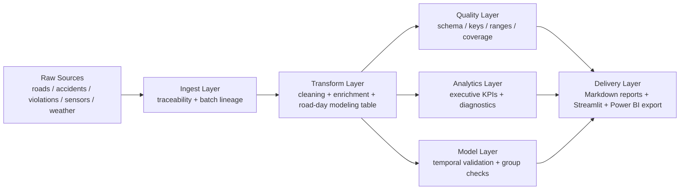

# Architecture Overview

## Explanation

- Raw sources stay separated to demonstrate multi-source collection.
- Ingest adds lineage fields for traceability.
- Transform enriches events and produces a reusable `road-day` analytical grain.
- Quality gates validate the data before reporting.
- Analytics and predictive outputs are delivered to leadership through reports, dashboard views, and a Power BI-ready star schema.
